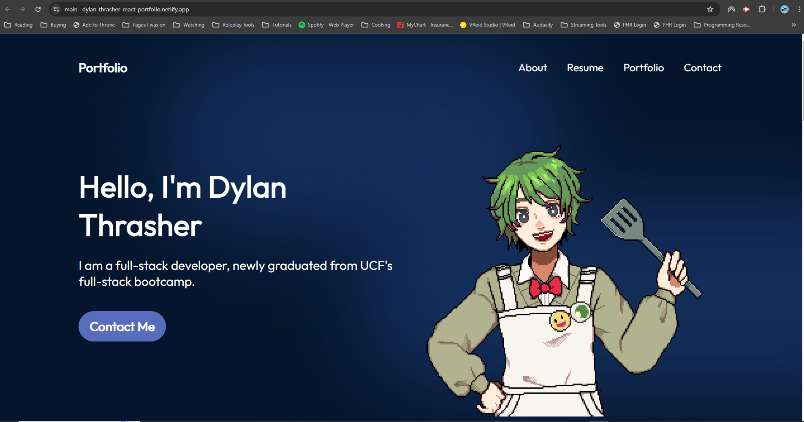

  # React-Portfolio
  ## Description
  A portfolio created with React
  ## Table of Contents
  * [Installation](#installation)
  * [Usage](#usage)
  * [License](#license)
  * [Contributing](#contributing)
  * [Questions](#questions)
  ## Installation
  In order to install, please make sure you have node package manager installed. Upon opening the cloned repository, run npm install.
  ## Usage
  In order to use the project, either run npm dev from the cloned repository in VS Code, or visit the website [here](https://main--dylan-thrasher-react-portfolio.netlify.app/). 
  
  ## License
  MIT
  ## Contributing
  The project was created with assistance from Code Complete's React Portfolio [tutorial](https://www.youtube.com/watch?v=YQCDUJ6hhNY) on youtube.
  ## Questions
  For any questions, please reference my repositories at [Dylan-Thrasher's Github](https://github.com/Dylan-Thrasher) or email me at thrasher_dylan@yahoo.com

  ## License 
  This project is licensed under the MIT license.
[License: MIT](https://opensource.org/licenses/MIT)
